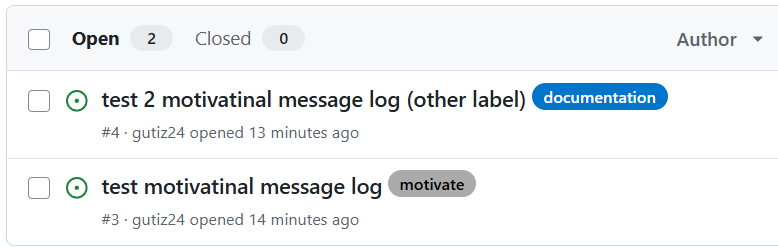
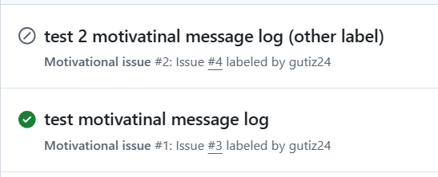
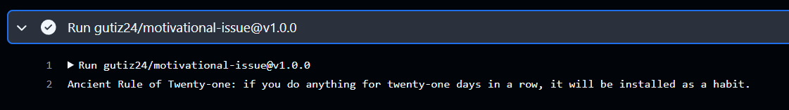

```diff
+ Propuesta Ejercicio 1
```
El archivo relacionado es [`.github/workflows/ci.yaml`](https://github.com/gutiz24/github-Actions-Laboratorio/blob/main/.github/workflows/ci.yaml)

El archivo está compuesto de diferentes partes

## Trigger de la pipeline

La pipeline solo se ejercutará cuando se haga una pull request sobre la rama `main` y haya algún cambio dentro de la carpeta `hangman-front/`
```yaml
on:
  pull_request:
    branches: [ main ]
    paths: [ "hangman-front/**" ]
```

## Build de la aplicación

El primer job definido es el build de la aplicación que se tratará de los siguientes pasos:

1. Hacer el checkout del repositorio de descargarse el proyecto en el paso `Checkout`
2. Luego en la acción `actions/setup-node@v4` se define la versión de node, en este caso la versión 16 por compatibilidades de usar la caché de la acción `cache: 'npm' \n cache-dependency-path: hangman-front/package-lock.json`
3. Ejecucón de los comandos de instalción limpia `npm ci` y build `npm run build --if-present` en el paso `build`
```yaml
  build:
    runs-on: ubuntu-latest
    steps:
      - name: Checkout
        uses: actions/checkout@v4
      - name: Set up Node.Js
        uses: actions/setup-node@v4
        with:
          node-version: 16
          cache: 'npm'
          cache-dependency-path: hangman-front/package-lock.json
      - name: build
        working-directory: ./hangman-front
        run: |
          npm ci
          npm run build --if-present
```
## Ejecución de Tests de la aplicación

Se trata de una ejecución parecida con el job de `build` solo que no se especifica una versión de node al venir los runners de github Actions con herramientas preinstaladas `node,docker,java,etc...`. 

Y se decide colocar una dependia entre jobs `needs: build` a modo ejemplo de cómo se realiza.

También como comando se usa `npm test` que será el responsable de ejecutar los test del proyecto
```yaml
  test:
    runs-on: ubuntu-latest
    needs: build
    steps:
      - name: Checkout
        uses: actions/checkout@v4
      - name: test
        working-directory: ./hangman-front
        run: |
          npm ci
          npm test
```
## Ejemplo de Ejecución de la Pipeline

Al solo activarse la pipeline con una pull request en cambios de archivos en la carpeta `hangman-front`, se va a mostrar el proceso que seguiría.

1. Creación de una nueva rama local con `git checkout -b gha-test`
2. Subirla en el repositorio remoto `git push -u origin gha-test`
3. Generar cambios dentro del proyecto `hangman-front`. Por ejemplo crear un `README`
<p align="center">
    
</p>

5. Se hace un `git add` `git commit` y `git push` del repo.
6. Hacer el pull request desde github
<p align="center">
    
</p>

7. Al revisar la ejecución de la pipeline se encuetran errores en los test. Mostrando así una de las funcionalidades de las pipelines
<p align="center">
    
    
</p>

8. Ajusando los valores de los test para que salga correcta la pipeline ya se puede hacer el merge corretamente
<p align="center">
    
</p>

```diff
+ Propuesta Ejercicio 2
```
## Trigger de la pipeline

En este Caso el trigger es de manera manual con la sentencia `workflow_dispatch`

```yaml
on:
  workflow_dispatch:
```

## Delivery

Respecto a las diferencias con la anterior pipeline de CI:
  - En el paso `Login to Github Container Registry` se usará para el inicio de sesión con el container registry, este caso el de github `ghcr.io`. El usuario usara es el que ejecute la pipeline `${{ github.actor }}` y como contraseña usará un token personal con el spoce de interacura con el registy `${{ secrets.GITHUB_TOKEN }}`
  - En el paso `Setup Docker builder` se habilitará la funcionalidad buildx de docker
  - En el paso `Build and push Docker image` se hace el build de la imagen con un archivo `Dockerfile` dentro de la carpeta `hangman-front/` y los sube al registry con el tag `ghcr.io/gutiz24/hangman-front-actions:latest`

```yaml
  delivery:
    runs-on: ubuntu-latest
    steps:
      - name: Checkout
        uses: actions/checkout@v4
      - name: Login to Github Container Registry
        uses: docker/login-action@v3
        with:
          registry: ghcr.io
          username: ${{ github.actor }}
          password: ${{ secrets.GITHUB_TOKEN }}
      - name: Setup Docker builder
        uses: docker/setup-buildx-action@v3
      - name: Build and push Docker image
        uses: docker/build-push-action@v6
        with:
          context: ./hangman-front
          push: true
          tags: ghcr.io/gutiz24/hangman-front-actions:latest
          file: ./hangman-front/Dockerfile
```

## Ejemplo de ejecución Pipeline

Al poderse ejecutar de forma manual, llendo a la parte de `Actions` nos deja correrlo haciendo click en `Run Workflow`
<p align="center">
    
</p>

El resultado de la pipeline seria la sigiente de la subida de una nueva imagen:
<p align="center">
    
    
</p>

```diff
+ Propuesta Ejercicio 3
```
En este caso para la ejecución de los test end2end como se debe tener tanto `hangman-front` y `hangman-api` corriendo a la vez. Se ha decidido crear un `docker-compose.yaml` que levante esos 2 servicios y exponga sus puertos `3001` y `8080` respectivamente en el workflow de `.ghithub/workflows/test_e2e.yaml`

## Trigger de la pipeline

En este Caso el trigger es de manera manual con la sentencia `workflow_dispatch`

```yaml
on:
  workflow_dispatch:
```
## e2e-test

1. Las diferencias con respecto los anteriores wokflows es la implementación de un paso `run docker compose` que se levantará el docker-compose definido.
2. En el siguiente paso `Cypress run` se hace uso de la acción oficial de cypress `cypress-io/github-action@v6` con los parámetros:
  - Donde se posicionan la carpeta de cypress `working-directory: hangman-e2e/e2e`
  - comando a ejecutar para correr los tests `start: npm run open`
  - comando para que espere a los servicios a que respondan correctamente con un `200` antes de ejecutar los tests `wait-on: "http://localhost:3001/api/topics, http://localhost:8080"`
3. Y como último paso se sube un artefacto que es propio de cypress de generar un video de cómo ha ejecutado las pruebas. A este artefacto se le dio el nombre de `name: Video-Test-Cypress`

* **Resultado de la operación**
<p align="center">
    
</p>

```yaml
  e2e-test:
    runs-on: ubuntu-latest
    steps:
      - name: Checkout
        uses: actions/checkout@v4
      - name: run docker compose
        run: docker compose up -d --build
      - name: Cypress run
        uses: cypress-io/github-action@v6
        with:
            working-directory: hangman-e2e/e2e
            start: npm run open
            wait-on: "http://localhost:3001/api/topics, http://localhost:8080"
      - name: Upload artifacts (Cypress Video)
        uses: actions/upload-artifact@v4
        with:
          name: Video-Test-Cypress
          path: hangman-e2e/e2e/cypress/videos
```

```diff
+ Propuesta Ejercicio 4
```
> [!NOTE]
> Se ha utilizado otra API `https://zenquotes.io/api/random` de generación de frases al no estar disponible la originalmente propuesta

El código funete del github Action personalizado se encuentra en: [`gutiz24/motivational-issue`](https://github.com/gutiz24/motivational-issue)

Los archivos principales son:
 - `index.js` donde se hace la recogia de los datos de la API y se imprime por consola
 - `actions.yaml` donde se explica qué hace el actions y como se ejecuta. Este caso `using: 'node20'` y el archivo principal a ejecutar `main: 'index.js'`. También es mismo archivo será para que github lo reconozca como una action.

action.yaml
```yaml
name: 'Motivational message'
description: 'Motivational message by Issue label "motivate"'
runs:
  using: 'node20'
  main: 'index.js'
```

## Trigger del workflow

Este caso el trigger se trat cuanto hay una nueva issue en el repo y este esté etiquetado

```yaml
on:
    issues: 
        types: [labeled]
```

## motivational-issue
Este job tiene un condicional aplicado que solo cuando tenga la etiqueta con le valor `motivate` se ejecutará

Luego el siguinte paso `gutiz24/motivational-issue@v1.0.0` ya hará uso de la acción personalizada anteriormente creada

```yaml
    motivanional-issue:
        if: ${{ github.event.label.name == 'motivate' }}
        runs-on: ubuntu-latest
        
        steps:
            - uses: gutiz24/motivational-issue@v1.0.0
```

## Ejemplo de ejecución

Se crearon 2 issues. Uno con la etiqueta `motivate` y otra sin esa etiqueta.
<p align="center">
    
</p>

Ejemplo de ejecución del workflow. Como se puede ver, solo se ejecutó cuando había la etiqueta `motivate`
<p align="center">
    
</p>

Ejemplo de frase motivacional por consola en el workflow que se ejecutó
<p align="center">
    
</p>